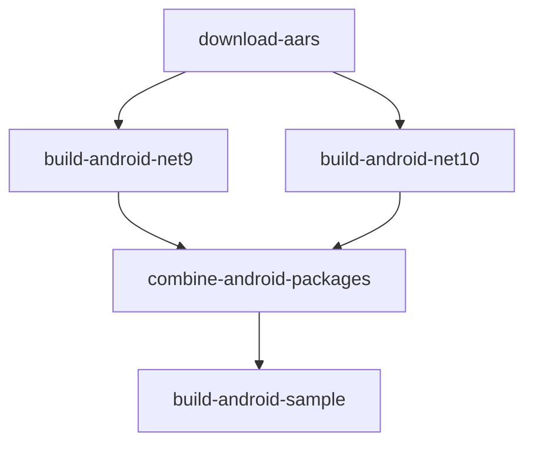
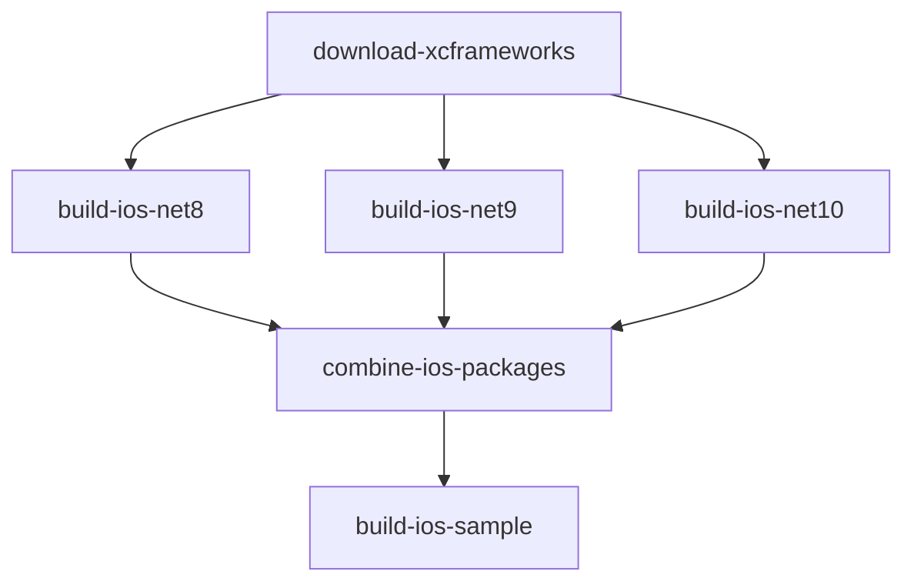

# GitHub Actions Workflow Architecture

This document describes the complete CI/CD pipeline architecture for building, testing, and publishing the Datadog SDK for .NET MAUI.

## Overview

The build system consists of multiple GitHub Actions workflows that work together to provide a complete CI/CD pipeline. The workflows are designed to:

- **Run in Parallel**: Android and iOS builds execute simultaneously
- **Cache Aggressively**: Downloaded dependencies and built packages are cached
- **Support Multi-Targeting**: Build for multiple .NET versions (8, 9, 10)
- **Validate Quality**: Check code formatting, links, and package integrity
- **Automate Releases**: Create GitHub releases and publish to NuGet.org

## Workflow Structure

```
build-all.yml (Orchestrator)
├── build-android.yml (Parallel)
│   ├── download-aars
│   ├── build-android-net9
│   ├── build-android-net10
│   ├── combine-android-packages
│   └── build-android-sample
└── build-ios.yml (Parallel)
    ├── download-xcframeworks
    ├── build-ios-net8
    ├── build-ios-net9
    ├── build-ios-net10
    ├── combine-ios-packages
    └── build-ios-sample
```

## Core Workflows

### 1. Build All Platforms (`build-all.yml`)

**Triggers**:
- Push to `main` or `develop` branches
- Pull requests to `main` or `develop`
- Manual workflow dispatch
- Weekly schedule (Mondays at 9 AM UTC)

**Path Filters**:
Only runs when these paths change:
- `Datadog.MAUI.Android.Binding/**`
- `Datadog.MAUI.iOS.Binding/**`
- `samples/**`
- `scripts/**`
- `Directory.Build.props`
- `.github/workflows/**`

**Jobs**:
1. **build-android**: Calls Android build workflow (runs in parallel)
2. **build-ios**: Calls iOS build workflow (runs in parallel)
3. **validate-builds**: Validates both builds completed, generates summary
4. **create-release**: Creates GitHub release when tagged (only for version tags)

**Outputs**:
- Combined NuGet packages artifact (`all-nuget-packages`)
- Build summary with package counts
- SHA256 checksums for package verification

### 2. Build Android Bindings (`build-android.yml`)

**Workflow Type**: Reusable workflow (called by `build-all.yml`)

**Job Flow**:



#### Job: `download-aars`
- **Runner**: `ubuntu-latest`
- **Purpose**: Download Android AAR files from Maven/GitHub
- **Caching**:
  - Cache key: `${{ runner.os }}-aars-${{ version }}`
  - Cached paths: `Datadog.MAUI.Android.Binding/**/aars/*.aar`
- **Output**: Uploads AAR files as artifact (`android-aar-files`)

#### Job: `build-android-net9`
- **Runner**: `ubuntu-latest`
- **Purpose**: Build Android bindings for .NET 9
- **Caching**:
  - Workloads: `~/.dotnet/sdk-manifests`, `~/.dotnet/metadata`, `~/.nuget/packages`
  - NuGet packages: `./artifacts-net9/*.nupkg`
- **Steps**:
  1. Download AAR files artifact
  2. Setup .NET 9 SDK with global.json
  3. Install Android workload
  4. Workload restore + package restore
  5. Build with `net9.0-android` target
  6. Pack NuGet packages
- **Output**: `android-nuget-packages-net9` artifact

#### Job: `build-android-net10`
- **Runner**: `ubuntu-latest`
- **Purpose**: Build Android bindings for .NET 10
- **Caching**: Similar to net9 build
- **Steps**: Same as net9 but with .NET 10 SDK
- **Output**: `android-nuget-packages-net10` artifact

#### Job: `combine-android-packages`
- **Runner**: `ubuntu-latest`
- **Purpose**: Merge net9 and net10 packages into unified multi-targeting packages
- **Process**:
  1. Download both net9 and net10 artifacts
  2. Extract each package
  3. Copy net10 framework libs into net9 package structure
  4. Repackage with both target frameworks
- **Output**: `android-nuget-packages` artifact (combined)

#### Job: `build-android-sample`
- **Runner**: `ubuntu-latest`
- **Purpose**: Validate packages by building sample app
- **Steps**:
  1. Download combined packages
  2. Add local NuGet source
  3. Build sample app for `net10.0-android`
- **Output**: Sample APK artifact

### 3. Build iOS Bindings (`build-ios.yml`)

**Workflow Type**: Reusable workflow (called by `build-all.yml`)

**Job Flow**:



#### Job: `download-xcframeworks`
- **Runner**: `macos-latest`
- **Purpose**: Download iOS XCFrameworks from GitHub releases
- **Caching**:
  - Cache key: `${{ runner.os }}-xcframeworks-${{ version }}`
  - Cached paths: `Datadog.MAUI.iOS.Binding/Libs/*.xcframework`
- **Xcode**: Selects Xcode 15.4
- **Output**: Uploads XCFrameworks as artifact (`ios-xcframeworks`)

#### Job: `build-ios-net8`
- **Runner**: `ubuntu-latest` (iOS bindings can build on Linux!)
- **Purpose**: Build iOS bindings for .NET 8
- **Caching**:
  - Workloads: iOS workload manifests
  - NuGet packages: `./artifacts-net8/*.nupkg`
- **Steps**:
  1. Download XCFrameworks artifact
  2. Setup .NET 8 SDK with temporary global.json
  3. Install iOS workload
  4. Workload restore + package restore
  5. Build with `net8.0-ios` target
  6. Pack NuGet packages
- **Output**: `ios-nuget-packages-net8` artifact
- **Note**: Uses `continue-on-error: true` as iOS bindings are not yet complete

#### Jobs: `build-ios-net9` and `build-ios-net10`
- Similar to net8 build but with .NET 9 and .NET 10 SDKs respectively

#### Job: `combine-ios-packages`
- **Runner**: `ubuntu-latest`
- **Purpose**: Merge net8, net9, and net10 packages into unified multi-targeting packages
- **Process**:
  1. Download all three framework artifacts
  2. Determine base package (try net8 first, then net9)
  3. Extract and merge all framework versions
  4. Repackage with all target frameworks
- **Output**: `ios-nuget-packages` artifact (combined)
- **Note**: Handles missing packages gracefully (continues even if iOS builds fail)

#### Job: `build-ios-sample`
- **Runner**: `macos-latest` (required for iOS app building)
- **Purpose**: Validate packages by building sample iOS app
- **Output**: Sample .app artifact

## Supporting Workflows

### 4. Publish to NuGet (`publish-to-nuget.yml`)

**Trigger**: Manual workflow dispatch

**Inputs**:
- `release_tag`: GitHub release tag to publish from (e.g., `v3.5.0`)
- `dry_run`: Boolean to validate without publishing (default: `true`)

**Jobs**:
1. **download-release-packages**: Download .nupkg files from GitHub release
2. **validate-packages**: Verify package structure and metadata
3. **publish-to-nuget**: Push packages to NuGet.org (if not dry-run)
4. **dry-run-summary**: Show what would be published (if dry-run)

**Environment**: Uses `nuget-production` environment for secrets

**Features**:
- Checksum verification (SHA256)
- Duplicate detection (`--skip-duplicate`)
- Detailed success/failure tracking
- Safe dry-run mode for testing

### 5. Validate Pull Request (`validate-pr.yml`)

**Trigger**: Pull request events (opened, synchronize, reopened)

**Jobs**:
1. **validate-changes**: Check for version updates and documentation
2. **check-build**: Quick build validation
3. **link-checker**: Verify markdown links
4. **size-check**: Report AAR and XCFramework sizes

**Features**:
- Uses `tj-actions/changed-files` to detect what changed
- Warns if code changes without README updates
- Non-blocking (uses `continue-on-error` for checks)

### 6. Check SDK Updates (`check-sdk-updates.yml`)

**Triggers**:
- Weekly schedule (Mondays at 9 AM UTC)
- Manual workflow dispatch

**Purpose**: Monitor for new Datadog SDK releases

**Process**:
1. Fetch current version from `Directory.Build.props`
2. Query GitHub API for latest Android and iOS SDK releases
3. Compare versions
4. Create/update GitHub issue if updates available

**Output**: Issue with update instructions and links to release notes

## Caching Strategy

### AAR Files (Android)
- **Key**: `${{ runner.os }}-aars-${{ sdk-version }}`
- **Paths**: `Datadog.MAUI.Android.Binding/**/aars/*.aar`
- **Retention**: Permanent (until version changes)

### XCFrameworks (iOS)
- **Key**: `${{ runner.os }}-xcframeworks-${{ sdk-version }}`
- **Paths**: `Datadog.MAUI.iOS.Binding/Libs/*.xcframework`
- **Retention**: Permanent (until version changes)

### .NET Workloads
- **Key**: `${{ runner.os }}-dotnet-workload-{platform}-${{ dotnet-version }}`
- **Paths**:
  - `~/.dotnet/sdk-manifests`
  - `~/.dotnet/metadata`
  - `~/.dotnet/workloadsets`
  - `~/.nuget/packages`
- **Retention**: Permanent (until .NET version changes)

### NuGet Packages
- **Key**: `${{ runner.os }}-{platform}-{framework}-packages-${{ sdk-version }}-${{ hashFiles('**/*.csproj') }}`
- **Paths**: `./artifacts-{framework}/*.nupkg`
- **Retention**: Per-framework, invalidated by .csproj changes

## Artifact Retention

| Artifact Type | Retention Days | Purpose |
|---------------|----------------|---------|
| AAR files | 1 day | Temporary transfer between jobs |
| XCFrameworks | 1 day | Temporary transfer between jobs |
| NuGet packages (framework-specific) | 7 days | Debugging individual builds |
| Combined NuGet packages | 30 days | Release preparation |
| Sample APK/App | 7 days | Testing and validation |
| Build logs | 3 days | Debugging failures |

## Performance Optimizations

1. **Parallel Builds**: Android and iOS workflows run simultaneously
2. **Aggressive Caching**: Dependencies cached per SDK version
3. **Conditional Steps**: Skip cached builds entirely
4. **Ubuntu Runners**: Use Linux for iOS binding compilation (faster/cheaper)
5. **Artifact Reuse**: Download once, use across multiple jobs

## Release Process

### Creating a Release

1. **Tag the commit**:
   ```bash
   git tag v3.5.0
   git push origin v3.5.0
   ```

2. **Automatic build**: `build-all.yml` detects tag and triggers `create-release` job

3. **GitHub Release created** with:
   - All NuGet packages
   - SHA256 checksums
   - Release notes
   - Documentation links

### Publishing to NuGet

1. Navigate to Actions → "Publish to NuGet"
2. Click "Run workflow"
3. Enter release tag (e.g., `v3.5.0`)
4. Choose "Dry run" = `true` for validation
5. Review validation results
6. Re-run with "Dry run" = `false` to publish

## Monitoring

### Build Status
- Check Actions tab for workflow runs
- Review job summaries for package counts
- Download artifacts for local testing

### SDK Updates
- Weekly automated checks
- GitHub issues created automatically
- Release notes linked in issues

### Package Health
- Checksum verification on publish
- Structure validation before release
- Sample app builds confirm usability

## Troubleshooting

### Build Failures

1. **Check cache status**: Invalidate if corrupted
2. **Review build logs**: Download from failed job
3. **Test locally**: Use same commands from workflow
4. **Check dependencies**: Verify AAR/XCFramework downloads

### Cache Issues

Clear caches via Actions settings or change version in `Directory.Build.props`

### Publishing Failures

1. Review validation job output
2. Check NuGet API key is valid
3. Verify packages not already published
4. Check package size limits

## Future Enhancements

- [ ] Add automated testing workflows
- [ ] Implement code signing for packages
- [ ] Add automated changelog generation
- [ ] Create performance benchmarking workflow
- [ ] Add automated dependency updates (Dependabot)
