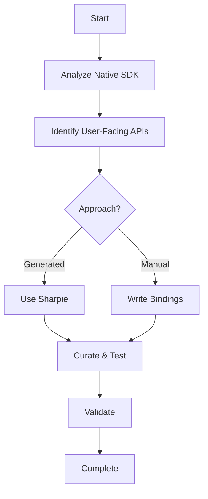

# iOS Development Guides

Complete guides for iOS development with the Datadog MAUI SDK.

## Core Documentation

### Binding Strategy

**[iOS Binding Strategy](../../guides/ios/IOS_BINDING_STRATEGY.html)** - Complete approach to iOS bindings:

- **Generated vs Manual Bindings**: Comparison and decision framework
- **API Identification Methodology**: How to determine what to bind
- **Implementation Checklist**: Step-by-step binding process
- **Best Practices**: Lessons learned and recommendations

**Key Topics**:
- Sharpie-generated bindings vs manual
- Minimal viable binding approach
- Public vs internal API identification
- Testing and validation

### API Identification

**[Identifying User-Facing APIs](../../guides/ios/IDENTIFYING_USER_FACING_APIS.html)** - Methodology for API identification:

- **Analysis Approach**: How to analyze native SDKs
- **Classification System**: Public vs internal APIs
- **Decision Framework**: What to include/exclude
- **Examples**: Real-world API analysis

### Concrete Example

**[RUM Binding Comparison](../../guides/ios/RUM_BINDING_COMPARISON.html)** - Before/after binding example:

- **Generated Binding**: What Sharpie produces
- **Manual Binding**: Curated, minimal approach
- **Analysis**: Side-by-side comparison
- **Lessons Learned**: Key takeaways

## Quick Start

### For New iOS Developers

1. Read [iOS Binding Strategy](../../guides/ios/IOS_BINDING_STRATEGY.html) for the overall approach
2. Use [Identifying User-Facing APIs](../../guides/ios/IDENTIFYING_USER_FACING_APIS.html) to analyze what to bind
3. Review [RUM Binding Comparison](../../guides/ios/RUM_BINDING_COMPARISON.html) for a concrete example

### Common Tasks

| Task | Guide Section |
|------|---------------|
| Start new iOS binding | [Binding Strategy - Implementation Checklist](IOS_BINDING_STRATEGY.html#implementation-checklist) |
| Identify APIs to bind | [API Identification - Analysis Approach](IDENTIFYING_USER_FACING_APIS.html#analysis-approach) |
| Decide on approach | [Binding Strategy - Decision Framework](IOS_BINDING_STRATEGY.html#generated-vs-manual-bindings) |
| See real example | [RUM Comparison - Full Example](../../guides/ios/RUM_BINDING_COMPARISON.html) |

## iOS Binding Workflow

## Related Documentation

- [Project Guide](../../project/PROJECT_GUIDE.html) - Overall project structure
- [Scripts Overview](../../architecture/SCRIPTS_OVERVIEW.html) - Build automation for iOS
- [Packaging Architecture](../../architecture/PACKAGING_ARCHITECTURE.html) - iOS package structure
